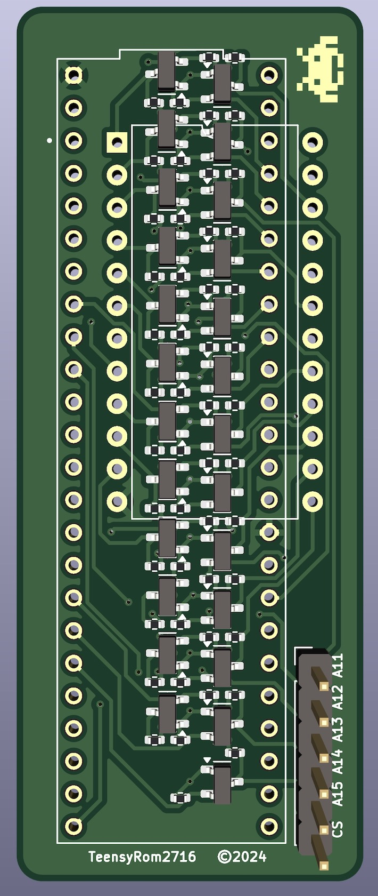
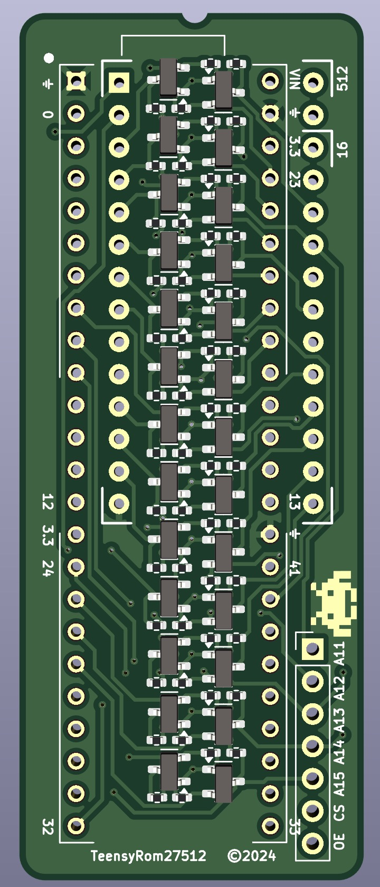
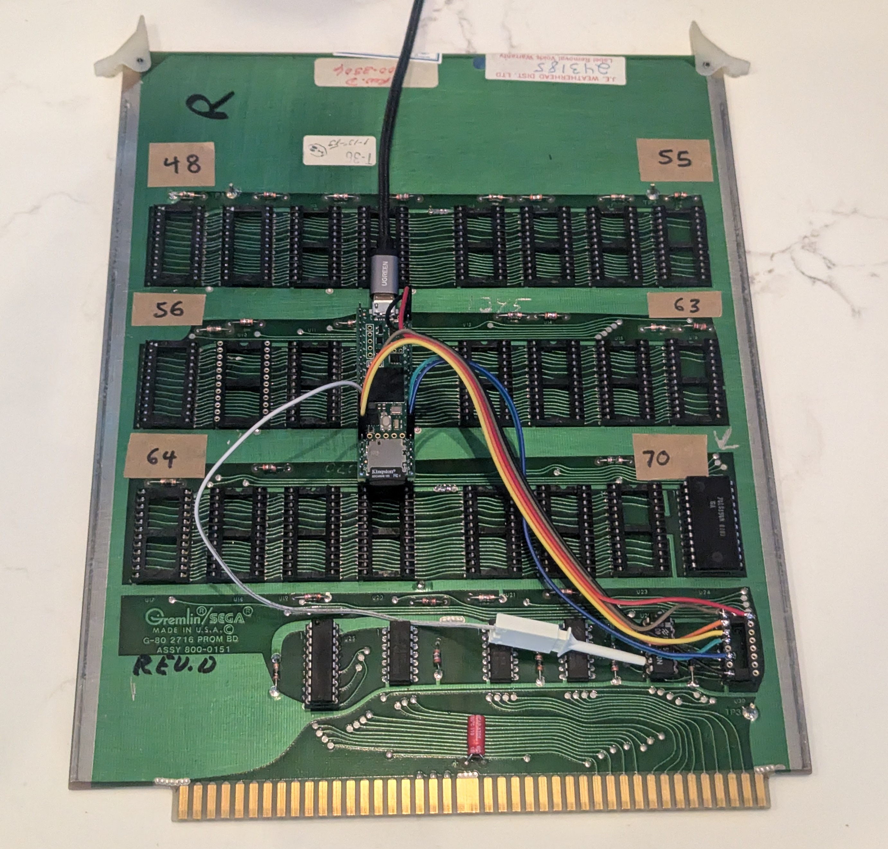

# teensy rom

* Plugs directly into a 2716/512 socket
* Runs very fast firmware to emulate an 2716/512 EEPROM
* Loads rom.bin from SD card
* Polls CS pin to toggle data output or tristate
* Up to 64KB supported with jumpers to a board beyond the 2716 socket

## Dependencies
* https://www.adafruit.com/product/4622
* Arduino IDE
* Teensy 4.1
* Jumper wires
* $10 level shifting PCBA from JLCPCB (fabrication outputs included)

## Inspired
by Ted Fried, MicroCore Labs [ROM Emulator](https://github.com/MicroCoreLabs/Projects/tree/master/EPROM_Emulator)

2716             |  27512
:-------------------------:|:-------------------------:
  |  

